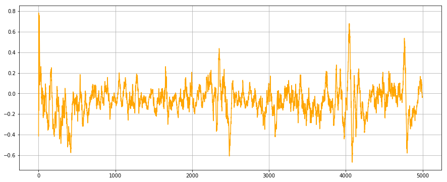
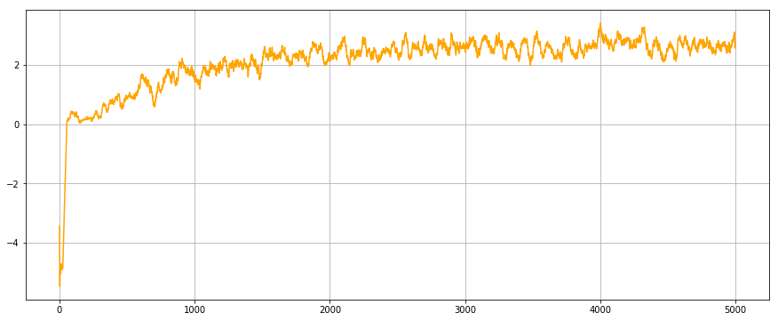
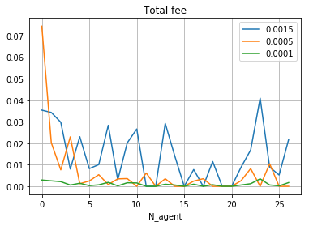
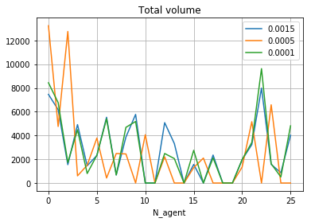
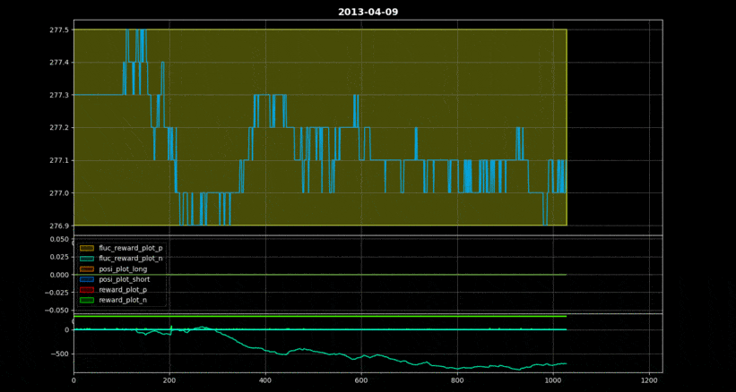

# Binanace_trading_simulation
This project is to about finding the optimal __Fee__ mechanism in the Exchange. RL agents acts as people under certain Fee policies. We observe how RL agents's behavior changes with Fee mechanism changes. Fee mechanism would change total trade volume and total fee. This project is maintained as Binance Fellowship.

Special thanks to providing nice trading environment https://github.com/Yvictor/TradingGym/

# Roadmap
1. Make RL agent which works on [trading gym](https://github.com/Yvictor/TradingGym/)
2. Put agents in our independent environment where various fee mechanisms are applied
3.  

Further :
Various Agent characteristics : tolearnce to risk , Different initial Asset
 


# Adopted Fee mechanisms
1. With no fee
2. 0.1% on every Purchase
3. Elastic fee depending on the trading volume contemporary( Fee increases when trading volume is high and vice versa)
4. Min(10$, 0.1% * purchase amount)


# Used Algorithms
## [PPO](https://arxiv.org/abs/1707.06347)
https://arxiv.org/abs/1707.06347
## [Rainbow](https://arxiv.org/abs/1710.02298)
https://arxiv.org/abs/1710.02298
## [Attention](http://nlp.seas.harvard.edu/2018/04/03/attention.html)
http://nlp.seas.harvard.edu/2018/04/03/attention.html

# Performance at trading gym

### PPO

### Rainbow



# How to use it

```python3
pip install -r requirements.txt
cd agent/PPO
python ppo_start.py
```
```python3
cd agent/Attention
python attention_start.py
```
```python3
cd agent/DQN
python dqn_start.py
```

## total fee and total volume under different fee rate




## Performance
