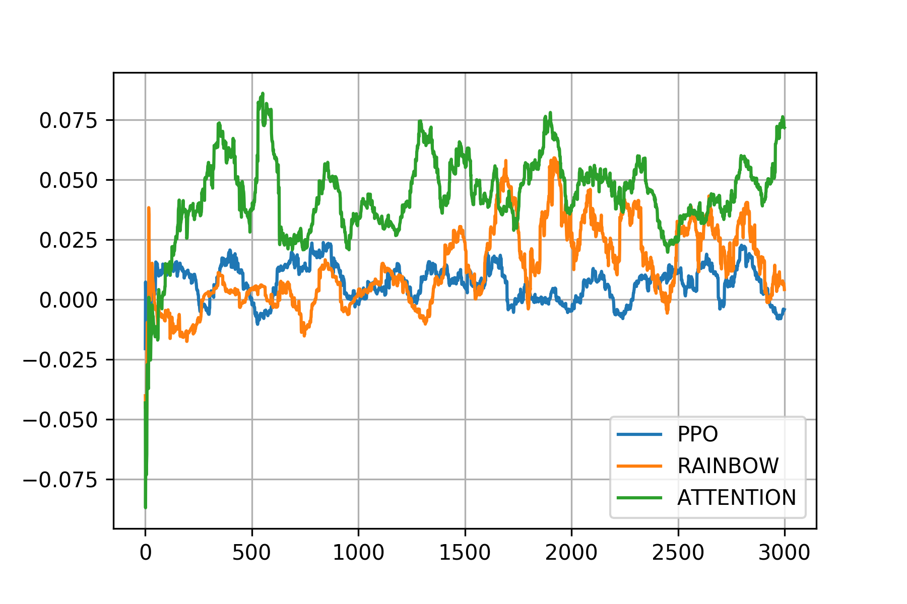
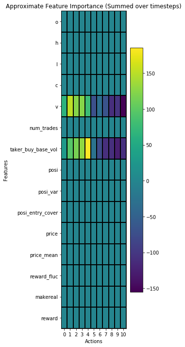
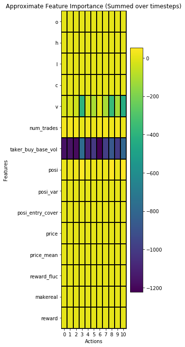
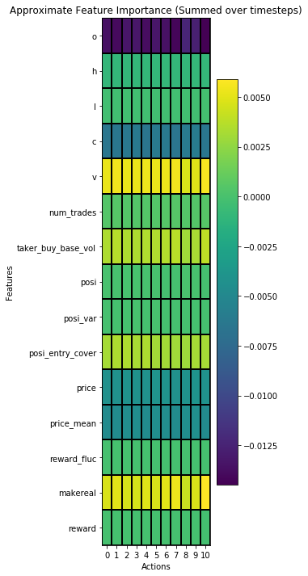

# Implementation of trading agents

Each directory continas explanation how to use it

## Characteristics of each Algorithms

### Rainbow
Off-policy learning 
Replay memory
nice explanation [here](https://github.com/Curt-Park/rainbow-is-all-you-need)

### PPO
On-policy learning
Always collects new experience

### Attention
Q , K, V

MultiHeadedAttention

Each layer determines how much importance each feature has

### Performance of each trading agents

### How Data feature affects TradingAgent's Decision
Using [integrated_gradient](https://medium.com/@kartikeyabhardwaj98/integrated-gradients-for-deep-neural-networks-c114e3968eae), we can interpret how agents observe the data.
X axis represents actions and Y axis represents the feature of data. The graph shows how the feature of data affects the action decision of trading agent. You can see that the weight distribution of feature is different depending on the training algorithms.

PPO

RAINBOW

Attention

